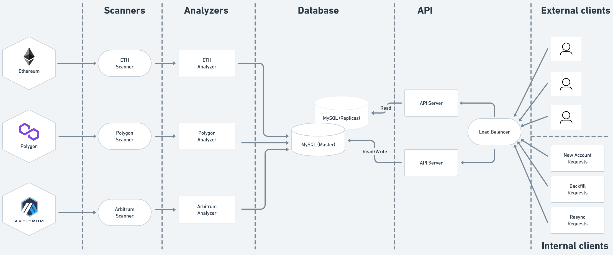

# High-Level Design (HLD) Document

## Problem Statement

In this document, we will discuss the design and implementation of a production-ready transaction indexing service for EVM-compatible blockchains. The system should be able to scan the blockchain, save all the transactions to a database, and provide APIs to get transaction history for multiple addresses across different networks.

## Design Goals/Requirements:

The developed system should:

1. Be able to scan blockchain transactions and record to a MySQL database
2. Provide an API for retrieving transaction histories, indexing new addresses
3. Allow different transaction analyzers to understand different protocols 
4. Be resilient to system failures and backfill in case of crashes or out-of-sync blockchain data
5. Be designed with an extensible architecture with the ability to add new transaction analyzers easily

## Architecture:

The proposed architecture for the transaction indexing service consists of several components as follows:

1. Blockchain Scanners (implemented in PoC):
   The blockchain scanners are responsible for scanning the EVM blockchains to detect and process all transactions for each block. The scanner will be deployed as a Node.js microservice application that will listen to incoming block data from the blockchain node. The scanner will extract all transactions from each block and pass them to the relevant transaction analyzer for further processing.
2. Transaction Analyzers (implemented in PoC):
   The transaction analyzers are responsible for analyzing transactions to extract relevant data and storing them in the database. A transaction analyzer will be a pluggable component that can be customized to work with different transaction types or protocols. For example, we can add an analyzer for ERC-20 token transfers, Uniswap trades, or any other transaction type that is relevant to the application. The analyzer will also be responsible for indexing the transaction history for each address and storing it in the database.
3. Database (implemented in PoC):
   The database will be responsible for storing all transaction data and address history. We will use MySQL as our primary database, which provides excellent support for ACID transactions and has good scalability characteristics.
4. API (implemented in PoC):
   The API component will be responsible for exposing the transaction history and indexing APIs to external clients. The API will be built using Node.js and Express.js and will interact with the database to retrieve transaction data.
5. Load Balancer (not implemented in PoC):
   The load balancer component will be responsible for distributing incoming API requests to multiple instances of the API server for high availability and scalability. We can use services like Amazon Elastic Load Balancer (ELB) or Nginx to achieve this.
6. Resilience to Backfill (implemented for PoC):
   To handle crashes and out-of-sync blockchain data, we will implement a backfill mechanism that re-scans the blockchain from a specific block and reprocesses all transactions. This will ensure that our system is always up-to-date and can handle any failures or outages.
7. Monitoring and Alerting (not implemented for PoC):
   We will use a combination of logging, monitoring, and alerting tools to monitor the system's health and detect any issues or anomalies. We can use services like CloudWatch, Prometheus, Grafana, or Datadog for monitoring and alerting.